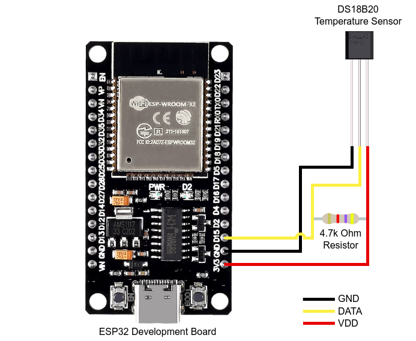
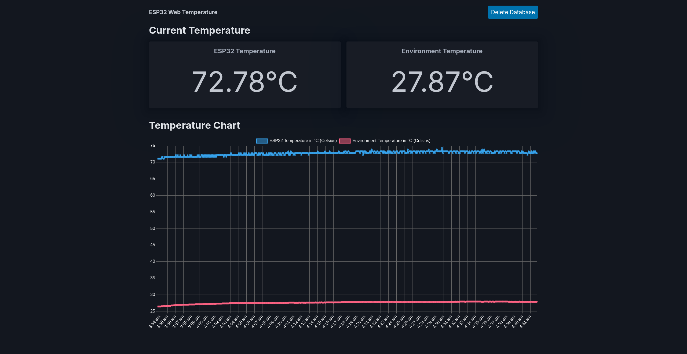

# esp32-web-temp

Deploy a Web Application inside ESP32 to display the chip (fun fact: ESP32 has a built-in temperature sensor) and the
environment temperature using the DS18B20 sensor. This project demonstrates how a modern web frontend can be deployed
into a small development board like ESP32. The web application is served by the ESP32 and uses WebSocket to communicate
sensor data. Collected sensor data is stored inside IndexedDB, a database found inside the browsers.

## Wiring Diagram

Take note that you must be facing the flat and printed portion of the DS18B20 for the exact pinout.

## Web Application

Before you can visit the web application, flash the firmware and the filesystem images first. To view the web
application, connect to the access point named `esp32temp`. Once connected, open a browser and head to the
link http://esp32temp.local.

## Setup

1. Install [PlatformIO](https://platformio.org/install/).
2. Install [Node.js](https://nodejs.org/en/download) and [pnpm](https://pnpm.io/installation), especially if you want
to tweak the frontend of this project.
3. Clone this repository.
4. Open this project in PlatformIO. Wait for a moment while it installs its dependencies.
5. Open a terminal and head to the `frontend/` directory of this project.
   - Run `pnpm install` to install the dependencies of the frontend.
   - Run `pnpm dev` to start a development server for the frontend.
   - Run `pnpm build` to build the source. The output of this process is found in the `data/frontend` directory.
6. In the PlatformIO, click `Build` and `Build Filesystem Image` to prepare the image for the firmware
and the frontend files.
7. Click `Upload` and `Upload Filesystem Image` to flash the images of firmware and the frontend files.
Make sure that the ESP32 development board is connected to the machine where PlatformIO is running.

## Requirements

### Software

- [PlatformIO](https://platformio.org/)
  - Arduino Framework
- [Node.js](https://nodejs.org/)
- [pnpm](https://pnpm.io/)

### Hardware

- ESP32 Development Board
- DS18B20 Temperature Sensor (Connect its `DATA` pin to pin `D15` in the ESP32 board)
- 4.7k ohm Resistor (Connect this to the `DATA` and `VDD` pin of the DS18B20 sensor)

## Project Structure
- `data/` contains the files of the frontend for the web application.
  - `frontend/` inside the `data` folder contains the build output files of the frontend part of this project.
- `frontend/` contains the source code of the frontend part. This is where you work on if you want to modify the
frontend of the web application.
- `include/` contains the project header files.
- `src/` contains the `main.cpp` file which is the entrypoint for the firmware.
- `partitions.csv` describes flash partition of the ESP32 development board.
- `plaformio.ini` contains the details and dependencies of this project.